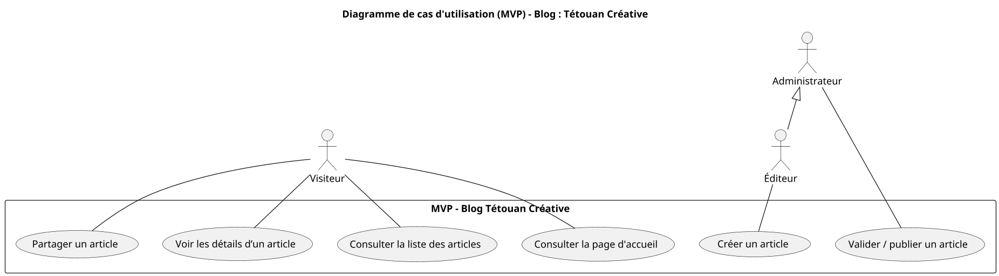

# 🌆 Blog “Tétouan – Tétouan Créative”

---

## 🎯 1. Contexte du projet

**Blog “Tétouan – Tétouan Créative”**, un espace numérique dédié à la **mise en valeur des artistes, artisans et du patrimoine culturel de la ville de Tétouan 🎭**.  
L’objectif du projet est d’offrir une **vitrine en ligne** où le contenu est **créé et géré par l’administrateur du blog** afin de promouvoir le savoir-faire local, les traditions artistiques et l’identité créative de la ville.

---

## 🎨 2. Style & Design

**Ambiance artistique, élégante et lumineuse**, reflétant la beauté andalouse et méditerranéenne de Tétouan.

**Palette de couleurs harmonieuse :**
- Bleu andalou `#497EB8`  
- Blanc pur `#F7F7F7`  
- Beige sable `#E7D8C9`  
- Doré clair `#CBA35C`  
- Gris doux `#E2E2E2`

**Style visuel :** textures rappelant la céramique, les zelliges et les façades blanches de la médina.  
**Typographie :** artistique et lisible (titres raffinés, paragraphes sobres).  
**Effets :** hover doux et animations subtiles sur les boutons et cartes.  
**Structure :** fluide et épurée pour mettre en avant les visuels.

**Framework :** HTML + Tailwind CSS *(sans frameworks JS)*.

---

## 🧱 3. Pages à prévoir

### 🌐 Espace Public
- **Page d’accueil (Accueil)**  
- **Page liste des articles (Articles)**  
- **Page détail d’un article (Détail Article)**

### 🔐 Espace Administrateur
- **Gestion des articles (CRUD complet)**  
- **Validation et publication des articles**

---

## 📌 4. Sections principales

- **Navbar fixe :** Accueil et Articles  
- **Section d’introduction :** grande image de Tétouan avec un slogan du type  
  > “Tétouan, l’art dans chaque rue”
- **Liste d’articles :** cartes présentant les articles (image, titre, extrait, date)
- **Page Détail Article :** contenu complet avec photos, description et auteur (Admin)
- **Footer :** contact, réseaux sociaux, et mention du projet

---

## 🧑‍🤝‍🧑 5. Expérience utilisateur (UX)

- Navigation simple et fluide  
- Lecture agréable, textes clairs et bien espacés  
- Design responsive sur mobile, tablette et ordinateur  
- Interactions légères (hover sur cartes, boutons animés)  
- Ambiance visuelle chaleureuse et créative  

---

## ⚙️ 6. Technologies

- **HTML + Tailwind CSS**  
- Aucune bibliothèque JavaScript lourde  
- Animations CSS légères et harmonieuses  

---

## ✍️ 7. Format attendu

- Code HTML + CSS propre et bien structuré  
- Responsive Design  
- Palette cohérente avec le thème artistique de Tétouan  
- Effets de survol et transitions douces  

---

## 📊 Diagramme de cas d'utilisation — MVP “Tétouan Créative”

---

## 🗂️ Plan du site — Blog "Tétouan Créative"

### 🌿 Espace Public

| Page | Description |
|------|-------------|
| **Accueil** | Page d'introduction avec image et slogan sur l'art à Tétouan. Présente les derniers articles publiés. |
| **Articles** | Liste des articles sur les artistes, galeries et initiatives culturelles. |
| **Détail Article** | Page détaillée d'un article avec images, texte complet et bouton de partage. |

### 🔐 Espace Administrateur / Éditeur

| Page | Description |
|------|-------------|
| **Dashboard Admin** | Vue d'ensemble des articles (publiés, en attente, brouillons). |
| **Créer un Article** | Formulaire pour rédiger un nouvel article (titre, image, contenu). |
| **Modifier un Article** | Modification d'un article existant. |
| **Supprimer un Article** | Suppression d'un article. |
| **Valider un Article** | Validation et publication sur le site. |

### 🛠️ Fonctionnalités clés

✅ Navigation claire et fluide  
✅ CRUD complet des articles  
✅ Interface administrateur simple et fonctionnelle  
✅ Design inspiré de l'art tétouanais  
✅ Palette méditerranéenne et élégante  
✅ Animations légères pour une expérience immersive

### 💡 Note :

Le blog "Tétouan Créative" doit transmettre l'âme artistique et culturelle de la ville, avec des couleurs chaudes et bleues, des textures inspirées des zelliges et de l'artisanat local, et une mise en page qui valorise les images et les récits des artisans.
